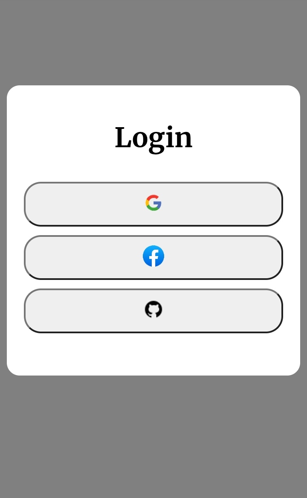
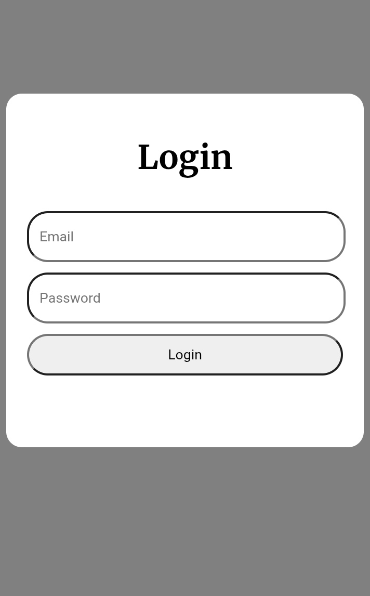

# 📄Login page practice project

<p>Login page project is my practice project specially for JavaScript.</p>
<p>In this website user will choose from which application user want to login then enter details and Login Successfully pop up will seen.

# Technologies used


# ScreenShot 

<p align="center">


</p>

# 📎 Live Demo

[](https://loginpage-2026.netlify.app/)

# Project Structure 

```
Login-page-practice-Project/
│
├── index.html
├── README.md
│
└── images/
    ├── 960px-Facebook_f_logo_(2021).svg.png
    ├── IMG_20260815_215800.jpg
    ├── IMG_20260815_215821.jpg
    ├── google-logo-transparent-background.png
    └── icons8-github-30.png
```
# What I learned

```
 I learned much from this project-
1 Use of display none.
2 Use of function in JavaScript.
3 To make a card 
```

# Author
Kartik Kushwaha
⭐ If you like this project, consider giving it a star.